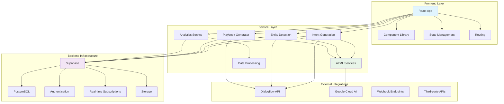
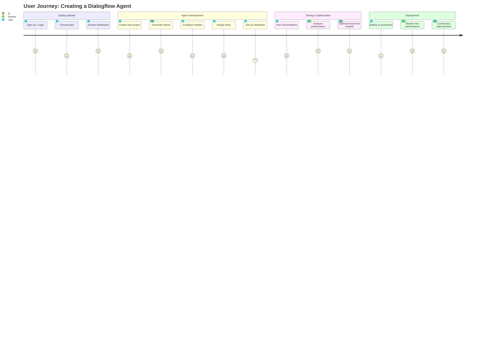
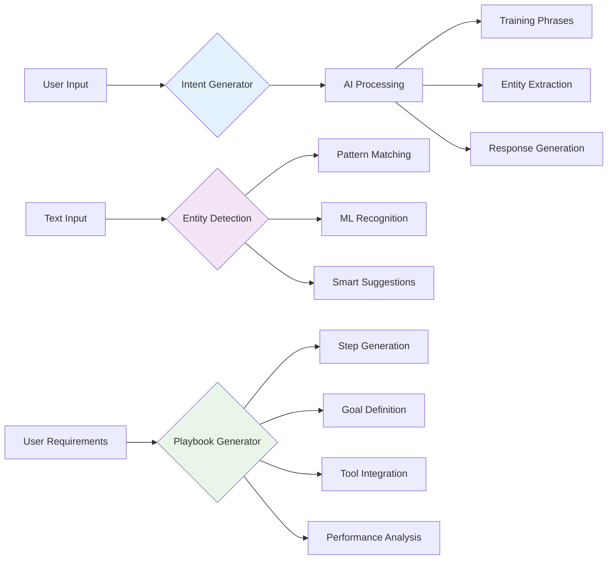
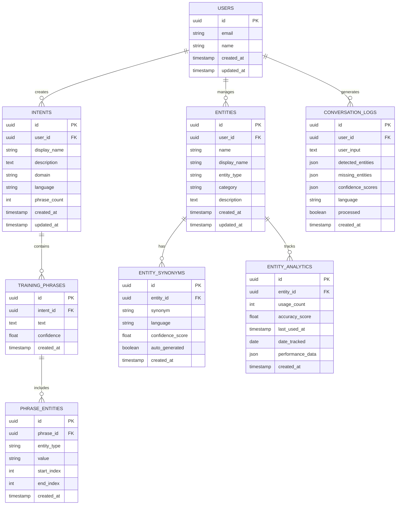
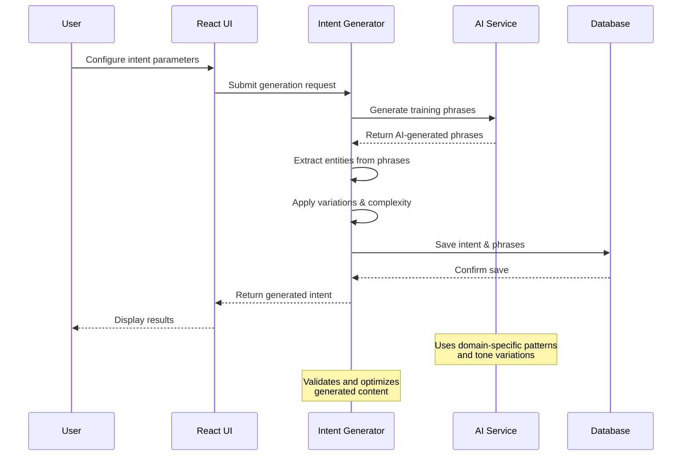
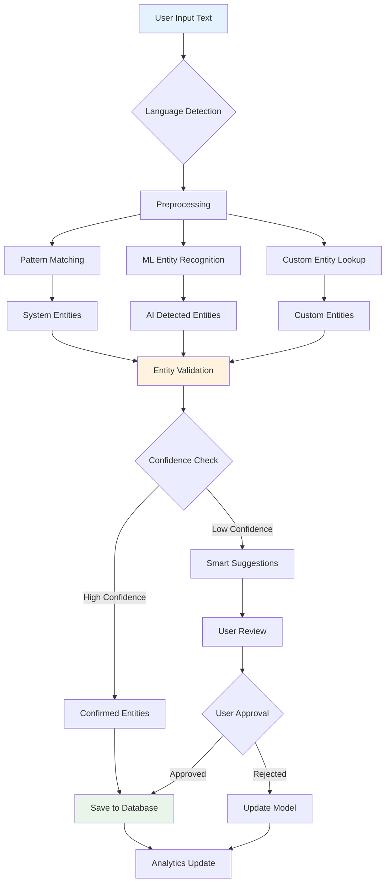
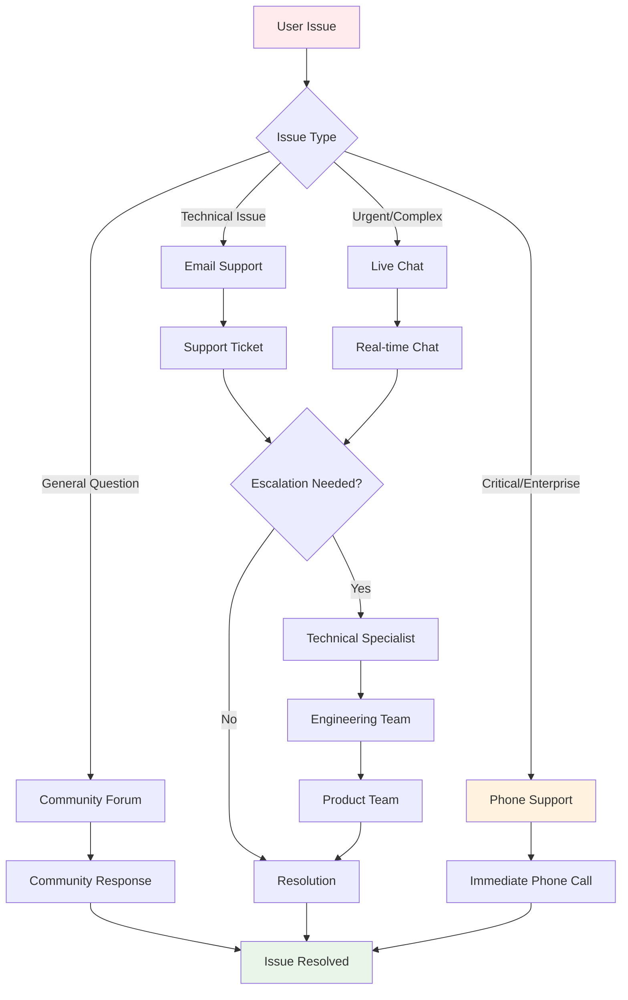
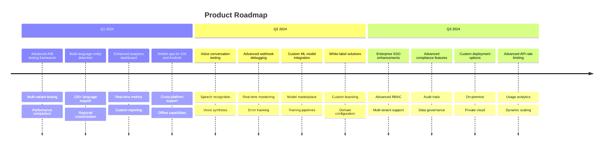

# Agents Buddy 🤖

A comprehensive platform for building, managing, and optimizing Dialogflow agents with AI-powered tools and enterprise-grade features.


## 🚀 Overview

Agents Buddy is a modern web application that empowers developers and businesses to create exceptional conversational AI experiences. With AI-powered generation tools, comprehensive analytics, and enterprise-grade features, it streamlines the entire Dialogflow development lifecycle.

## 🏗️ System Architecture



## 🔄 User Workflow



## ✨ Key Features

### 🎯 AI-Powered Generators



### 📊 Analytics & Insights
- **Entity Analytics**: Track entity usage and performance metrics
- **Conversation Logs**: Monitor and analyze user interactions
- **Performance Monitoring**: Real-time metrics and optimization suggestions
- **A/B Testing**: Test different conversation variations

### 🛠️ Development Tools
- **Visual Flow Designer**: Drag-and-drop conversation flow creation
- **Testing Suite**: Comprehensive testing tools for agent validation
- **Debugger**: Advanced debugging with flow visualization
- **Version Control**: Git integration for collaborative development

### 🎓 Learning & Support
- **Template Library**: Pre-built templates for common use cases
- **Learning Paths**: Comprehensive training materials
- **Live Support**: Multi-channel support with screen sharing and remote control
- **Documentation**: Interactive guides and API explorer

### 🏢 Enterprise Features
- **Multi-environment Support**: Development, staging, and production environments
- **SSO Integration**: SAML/OAuth authentication
- **Advanced Security**: SOC2, HIPAA, PCI compliance
- **Custom Integrations**: Tailored solutions for enterprise needs
- **Dedicated Support**: 24/7 phone and chat support

## 📊 Database Schema



## 🔄 Intent Generation Workflow



## 🛠️ Technology Stack

### Frontend
- **React 18** with TypeScript
- **Tailwind CSS** for styling
- **Shadcn/UI** components
- **React Router** for navigation
- **Recharts** for data visualization
- **Lucide React** for icons

### Backend & Database
- **Supabase** (PostgreSQL) for database
- **Supabase Auth** for authentication
- **Real-time subscriptions** for live updates

### Development Tools
- **Vite** for build tooling
- **ESLint** for code quality
- **TypeScript** for type safety

## 🚀 Getting Started

### Prerequisites
- Node.js 18+ 
- npm or yarn
- Supabase account

### Installation

1. **Clone the repository**
   ```bash
   git clone https://github.com/your-org/agents-buddy.git
   cd agents-buddy
   ```

2. **Install dependencies**
   ```bash
   npm install
   ```

3. **Set up environment variables**
   ```bash
   cp .env.example .env.local
   ```
   
   Configure your environment variables:
   ```env
   VITE_SUPABASE_URL=your_supabase_url
   VITE_SUPABASE_ANON_KEY=your_supabase_anon_key
   ```

4. **Set up the database**
   ```bash
   # Run the SQL migrations in your Supabase dashboard
   # or use the Supabase CLI
   supabase db push
   ```

5. **Start the development server**
   ```bash
   npm run dev
   ```

6. **Open your browser**
   Navigate to `http://localhost:5173`

## 📁 Project Structure

```
src/
├── components/           # Reusable UI components
│   ├── contact/         # Contact and support components
│   ├── entity-detection/# Entity management components
│   ├── intent-generator/# Intent generation tools
│   ├── live-support/    # Live support features
│   ├── playbook-generator/# Playbook creation tools
│   └── ui/             # Base UI components
├── pages/              # Page components
├── services/           # API and business logic
├── types/              # TypeScript type definitions
├── integrations/       # External service integrations
│   └── supabase/       # Supabase client and types
└── hooks/              # Custom React hooks
```

## 🎯 Usage Examples

### Generate Training Phrases
```typescript
import { generateIntent } from '@/services/intentGenerationService';

const config = {
  intentName: 'book.appointment',
  description: 'User wants to book a medical appointment',
  domain: 'healthcare',
  phraseCount: 15,
  includeEntities: true
};

const intent = await generateIntent(config);
```

### Detect Entities
```typescript
import { detectEntitiesInText } from '@/services/entityDetectionService';

const options = {
  language: 'en',
  minConfidence: 0.7,
  enableSmartSuggestions: true
};

const result = await detectEntitiesInText(userInput, options);
```

### Generate Playbook
```typescript
import { generatePlaybook } from '@/services/playbookGenerationService';

const config = {
  playbookName: 'Customer Support Assistant',
  description: 'Handle customer inquiries professionally',
  scenario: 'Customer contacts support with questions',
  domain: 'customer-support',
  complexity: 'moderate'
};

const playbook = await generatePlaybook(config);
```

## 🔄 Entity Detection Flow



## 💼 Pricing Plans

| Feature | Free | Developer ($29/mo) | Team ($99/mo) | Enterprise |
|---------|------|-------------------|---------------|------------|
| Intent Generations | 1,000 | 25,000 | 100,000 | Unlimited |
| Entity Extractions | 500 | 15,000 | 75,000 | Unlimited |
| Team Members | 1 | 1 | 10 | Unlimited |
| Support | Community | Email | Priority | 24/7 Phone |
| Advanced Features | ❌ | ✅ | ✅ | ✅ |

## 🔄 Support Channel Flow



## 🛡️ Security & Compliance

- **SOC2 Type II** certified
- **GDPR & CCPA** compliant
- **End-to-end encryption** for data in transit and at rest
- **Regional data residency** options
- **SSO integration** with SAML/OAuth
- **Audit logging** for enterprise customers

## 🤝 Contributing

We welcome contributions! Please see our [Contributing Guide](CONTRIBUTING.md) for details.

### Development Workflow

```mermaid
gitgraph
    commit id: "Initial"
    branch develop
    commit id: "Feature A"
    commit id: "Feature B"
    branch feature/new-feature
    commit id: "Work in progress"
    commit id: "Feature complete"
    checkout develop
    merge feature/new-feature
    commit id: "Integration tests"
    checkout main
    merge develop tag: "v1.0.0"
```

### Code Quality

- Run `npm run lint` to check code style
- Run `npm run type-check` to verify TypeScript types
- Follow the existing code conventions
- Write tests for new features

## 📚 Documentation

- [API Documentation](docs/api.md)
- [Component Library](docs/components.md)
- [Deployment Guide](docs/deployment.md)
- [Contributing Guidelines](CONTRIBUTING.md)

## 🗺️ Roadmap



## 🆘 Support

### Community Support
- [Discord Community](https://discord.gg/agents-buddy)
- [GitHub Discussions](https://github.com/your-org/agents-buddy/discussions)
- [Documentation](https://docs.agents-buddy.com)

### Professional Support
- Email: support@agents-buddy.com
- Enterprise customers: Get 24/7 phone support
- Response times: 15 minutes (Critical) to 24 hours (Low)

## 📄 License

This project is licensed under the MIT License - see the [LICENSE](LICENSE) file for details.

## 🙏 Acknowledgments

- Built with [React](https://reactjs.org/) and [TypeScript](https://www.typescriptlang.org/)
- UI components from [Shadcn/UI](https://ui.shadcn.com/)
- Database and auth powered by [Supabase](https://supabase.com/)
- Icons by [Lucide](https://lucide.dev/)
- Hosting on [Vercel](https://vercel.com/)

---

<div align="center">
  <strong>Made with ❤️ by the Agents Buddy team</strong>
  <br />
  <a href="https://agents-buddy.com">Website</a> •
  <a href="https://docs.agents-buddy.com">Documentation</a> •
  <a href="https://agents-buddy.com/contact">Contact</a>
</div>
